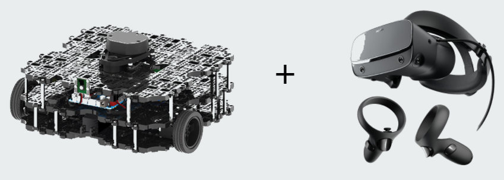
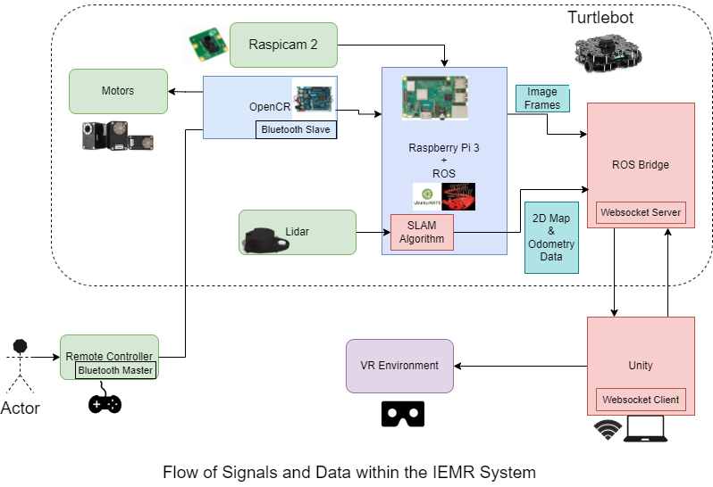

# Indoor Environment Mapping Robot (IEMR)

 

Robots can facilitate rescue operations by entering spaces that are dangerous or inaccessible. These robots usually make use of a camera to confer visibility to users. It is advantageous to also map the environment through the use of LIDAR sensors. This provides a geometric model which can be used in real time or throughout a mission. Example scenarios include:

* Searching for imperilled individuals in a burning building
* Searching for buried individuals in rubble
* Searching for hostages and suspects in a law enforcement situation

A simple wheel based solution has been used for movement. Combining the lidar mapping concept with more sophisticated movement to overcome difficult terrain would yield a more practical robot, but is outside the scope of this project.

## Minimum Requirements:
* Acquisition of 3D mapping of the environment using Lidar and SLAM
* Rendering of the environment in VR
* Remote control of the robot in VR

## System Architecture

 

### Softwares:
* OS: Ubuntu MATE (16.04) was built on RPi3
* ROS distribution: ROS Kinetic
* Unity
### Hardwares:
* Microcontrollers and Microprocessors
  * Raspberry Pi 3 and Intel Joule 570X
  * OpenCR microcontroller
* Sensors and Actuators
  * Lidar sensor (360 Laser Distance Sensor LDS-01)
  * Raspicam 2 and Intel real sense camera (R200)
  * Remote controller and bluetooth (RC-100B)
  * Motors - Dynamixel (XM430-W210-T)

## Demo Video
